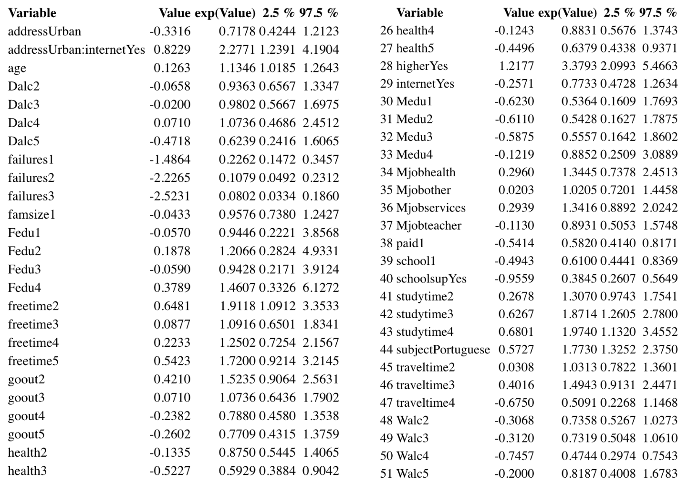
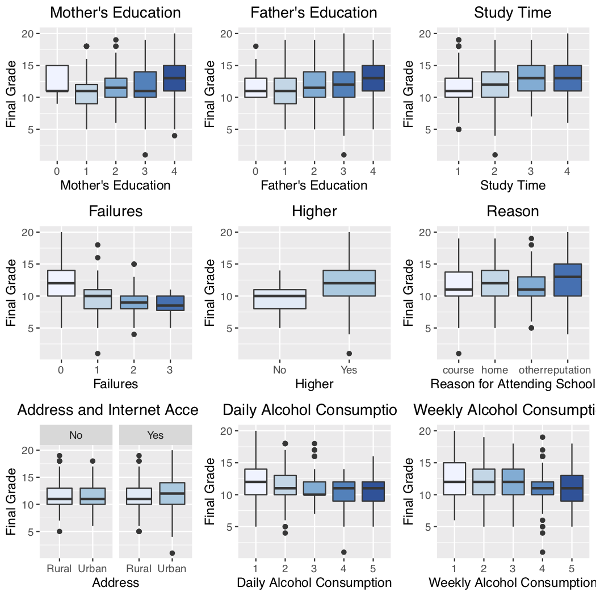

```{r setup, include=FALSE}
knitr::opts_chunk$set(echo = TRUE)
```

```{r packages, include=FALSE}
library(magrittr)
library(leaps)
library(ggplot2)
library(RColorBrewer)
library(rms)
library(tree)
library(MLmetrics)
library(broom)
library(dplyr)
library(plyr)
library(gridExtra)
library(car)

library(arm)
library(pROC)
library(e1071)
library(caret)
library(nnet)
library(knitr)
library(MASS)
library(kableExtra)

set.seed(11)
```

```{r data, echo=FALSE}
# loading the data
students <- read.table('students.csv', header=TRUE, sep=',')

students <- students[students$G3 != 0,]

students$subject <- ifelse(students$subject == 1, 'Portuguese', 'Math')
students$address <- ifelse(students$address == 1, 'Rural', 'Urban')
students$higher <- ifelse(students$higher == 1, 'Yes', 'No')
students$schoolsup <- ifelse(students$schoolsup == 1, 'Yes', 'No')
students$internet <- ifelse(students$internet == 1, 'Yes', 'No')
students$romantic <- ifelse(students$romantic == 1, 'Yes', 'No')

# combining columns
students <- students %>%   mutate(Mjob = case_when(Mjob_at_home == 1 ~ 'at_home',
                                                   Mjob_health == 1 ~  'health',
                                                   Mjob_other == 1 ~ 'other',
                                                   Mjob_services == 1  ~ 'services',
                                                   Mjob_teacher == 1 ~ 'teacher'))

students <- students %>%   mutate(Fjob = case_when(Fjob_at_home == 1 ~ 'at_home',
                                                   Fjob_health == 1 ~  'health',
                                                   Fjob_other == 1 ~ 'other',
                                                   Fjob_services == 1  ~ 'services',
                                                   Fjob_teacher == 1 ~ 'teacher'))

students <- students %>%   mutate(reason = case_when(reason_course == 1 ~ 'course',
                                                     reason_home == 1 ~  'home',
                                                     reason_other == 1 ~ 'other',
                                                     reason_reputation == 1  ~ 'reputation'))

students <- students %>%   mutate(guardian = case_when(guardian_father == 1 ~ 'father',
                                                       guardian_mother == 1 ~  'mother',
                                                       guardian_other == 1 ~ 'other'))

students <- students %>%   mutate(grade = case_when(G3 >= 16 ~ 'excellent',
                                                    G3 <= 15 & G3 >= 13 ~ 'very_good',
                                                    G3 <= 12 & G3 >= 11 ~ 'average',
                                                    G3 <= 10 & G3 >= 9 ~ 'sufficient',
                                                    G3 <= 8 ~ 'weak'))

# dropping repeat columns
repeats <- c("Mjob_at_home", "Mjob_health", "Mjob_other", "Mjob_services", "Mjob_teacher", "Fjob_at_home", "Fjob_health", "Fjob_other", "Fjob_services", "Fjob_teacher", "reason_course", "reason_home", "reason_other","reason_reputation", "guardian_father", "guardian_mother", "guardian_other")
students <- students[, !(names(students) %in% repeats)]

# converting all to factors
students[] <- lapply(students, factor)

# converting only numeric columns
nums <- c('age', 'overall_grade', 'absences', 'G3')
students[,nums] %<>% lapply(function(x) as.numeric(as.character(x)))

# mean center final grade
#students$final_grade_c <- students$G3 - mean(students$G3)

students$grade <- ordered(students$grade, levels = c('weak', 'sufficient', 'average', 'very_good', 'excellent'))
```

# Summary

What factors influence student grades? Social, demographic, family, and academic information can provide insight on student performance in school. For this analysis, we aim to identify  factors that influence overall student grade in addition to how alcohol consumption specifically impacts overall grade. To do so, important and signficant covariates were identified, and a proportional odds model was fit to predict students' grades. Based on the results of this proportional odds model, we found that number of past class failures and plannign on pursuing higher education are the two strongest predictors of final grade. Furthermore, consuming alcohol increasing a student's odds of receiving weaker grades. Overall, this study aims to identify factors that influence student academic performance.

# Introduction

For this analysis regarding factors that affect overall student grades, we will be aiming to answer three main questions.

1. What factors are the strongest predictors of overall student grades?
2. How does alcohol consumption affect overall student grades?
3. What other factors affect overall student grades?

More specifically, given this data including various social, demographic, family, and academic information for 10th through 12th graders, we aim to identify specific variables that influence student grades the most. For example, how do internet access, mother's occupation, father's education, extra tutoring sessions, or hours of free time impact a student's grades? How do extracurricular activities play a role? It is often considered that "going out" or excessive social time can decrease student's grades, but based on this data, is this actually true? This study aims to answer these questions, identifying factors that not only impact student grades but also surprisingly may not affect student grades.  

# Data

The dataset was obtained from Kaggle and was previously used in a paper by Paulo Cortez and Alice Silva titled "Using Data Mining to Predict Secondary School Student Performance." While their paper implements data mining models using all available data including previous periodic grades, this study focuses more on identifying specific factors that affect overall grade. The dataset includes demographic, social, family, and academic information and was gathered through a combination of academic records and self-reported surveys from 10th through 12th grade students (secondary school) from two public schools in Portugal for the 2005-2006 academic year. Notably, the legal drinking age in Portugal during 2005 and 2006 was 16, and 850 of the 1,044 students are 16 years of age or older. A summary of the variables available in the dataset are listed below, and a full data dictionary can be found in the appendix.

Summary of Variables:

Demographic     |      Social     |    Family    |   Academic
----------------|-----------------|--------------|------------
sex             |   activities    |   famsize    |   school
age             |   romantic      |   Pstatus    |   studytime
address         |   goout         |   Medu       |   failures
traveltime      |   freetime      |   Fedu       |   schoolsup
internet        |   Dalc          |   famsup     |   paid
health          |   Walc          |   famrel     |   nursery
                |                 |   Mjob       |   higher
                |                 |   Fjob       |   absences
                |                 |   guardian   |   subject
                |                 |              |   reason
                |                 |              |   G1
                |                 |              |   G2
                |                 |              |   G3
                
The original dataset contains 33 variables for 1,044 students, and the data dictionary provided by Cortez et al. can be found in the appendix. There are 53 students who have a final grade `G3` of 0. Many of these students have data for the second period grade `G2` but all have a grade for the first period grade `G1`. This pattern indicates that these students who have grades of 0 for `G3` may not have actually finished the course. Because course incompletion is different from actually receiving a 0 in the course, these students will be dropped from the dataset. No other missing variables are present. After dropping the students who have zeros for `G3`, the dataset has 991 students.

Final grades `G3` were binned into 5 levels. The observed mean (11.95) and median (12) of final grades `G3` were used to help generate bins. Thus, these bins are more representative of students' grades relative to the observed mean. A new variable `grade` was added according to the following table which also shows the counts for each binned grade level:

`G3` range    |   `grade`     |   count
--------------|---------------|------------
20 - 16       |   excellent   |   122
15 - 13       |   very good   |   285
12 - 11       |   average     |   254
10 - 9        |   sufficient  |   216
9 - 0         |   weak        |   114

For exploratory data analysis, chi-squared tests were conducted between `grade` and all predictors. At a significance of 0.05, there was a significant difference between `grade` and the following predictors: `school`, `address`, `studytime`, `schoolsup`, `paid`, `nursery`, `higher`, `internet`, `freetime`, `goout`, `health`, `subject`, `Mjob`, and `reason`. This provides an indication that `grade` differs among the different levels of each of the previously mentioned predictors.

However, some variables could not be used for chi-squared tests due to lack of data in specific combinations of variables and `grade` levels. Further model testing will account for this through deviance tests between nested models.

To further examine potential relationship between the various predictors and `grade`, plots were generated using the unbinned grade variable `G3` of final grades on a scale of 0 (low) to 20 (high). From the following plots of `failures`, `address`, `internet`, and `Dalc` against `G3`, it is evident that generally, students who had more past class failures tended to have lower final grades. Interestingly, those who live in urban areas and have internet access at home also tended to have higher grades than others. This indicates a possible interaction term between `address` and `internet`. Lastly, in the far right plot of `Dalc` against `G3`, there seems to be a very slight decrease in grade for increasing levels of `Dalc`, but further modeling is necessary to clarify this relationship. Other EDA plots with `G3` as the dependent variable can be found in the appendix.

```{r someeda, echo=FALSE, out.height='40%', out.width='75%', fig.align='center'}
pfailures <- ggplot(students, aes(x = failures, y = G3, fill = failures)) +
  geom_boxplot(show.legend = FALSE) +
  labs(title = "Failures",
       x = "Failures", 
       y = 'Final Grade') +
  scale_fill_brewer(palette="Blues") +
  theme(plot.title = element_text(hjust = 0.5))

pintadd <- ggplot(students, aes(x = address, y = G3, fill = address)) +
  geom_boxplot(show.legend = FALSE) +
  labs(title = "Address and Internet Access",
       x = "Address", 
       y = 'Final Grade') +
  scale_fill_brewer(palette="Blues") +
  theme(plot.title = element_text(hjust = 0.5)) + 
  facet_wrap(~ internet)

pDalc <- ggplot(students, aes(x = Dalc, y = G3, fill = Dalc)) +
  geom_boxplot(show.legend = FALSE) +
  labs(title = "Daily Alcohol Consumption",
       x = "Daily Alcohol Consumption", 
       y = 'Final Grade') +
  scale_fill_brewer(palette="Blues") +
  theme(plot.title = element_text(hjust = 0.5))

grid.arrange(pfailures, pintadd, pDalc, ncol=3)
```

# Model

For this analysis, a proportional odds model was chosen because the response variable `grade` has natural ordering for the five levels. Based on exploratory data analysis, a proportional odds model was fit with `grade` as the response variable. Based on the significant variables mentioned in EDA and other variables of interest, variables were added and removed through many deviance tests comparing nested models. Stepwise selection using AIC was also used for variable selection. Lastly, interaction terms were also tested using deviance tests. Variables and interactions were selected to remain in the final model if the p-value of the deviance test was below 0.05. Using this method, the final model is as follows:

$log(\frac{Pr[grade_i \leq j | x_i]}{Pr[grade_i > j | x_i]}) = x_i\beta, j = 1,..., 4$

where _x_ contains `failures`, `Medu`, `Dalc`, `Walc`, `higher`, `subject`, `studytime`, `address`, `freetime`, `internet`, `Fedu`, `age`, `Mjob`, `traveltime`, `famsize`, `schoolsup`, `goout`, `school`, `paid`, `health`, and an interaction between `address` and `internet`.

This model has an AIC of 2770.58 and overall accuracy of 40.06%. While this accuracy may seem low, this only portrays the explicitly correct predictions of `grade` and does not truly account for the ordered nature of the levels. The confusion matrix is as follows where rows are predicted levels and columns are actual levels. In this instance, the sensitivity is the count of correct predictions divided by the actual count for that variable (column total).

Prediction    |  weak | sufficient | average | very_good | excellent | predicted totals
--------------|-------|------------|---------|-----------|-----------|------------------
  weak        | 25    |     28     |   4     |    2      |    0      |  59
  sufficient  | 45    |     77     |  50     |    22     |    5      | 199
  average     | 33    |     62     |  93     |    60     |   10      | 258
  very_good   | 11    |     48     | 106     |   193     |   98      | 456
  excellent   |  0    |      1     |   1     |     8     |    9      |  19
--------------|-------|------------|---------|-----------|-----------|--------
actual totals | 114   |   216      |  254    |  285      |  122      |
--------------|-------|------------|---------|-----------|-----------|--------
sensitivity   | 0.22  |   0.36     |  0.37   |  0.68     |  0.074    |

The resulting model coefficients ("Value"), exponentiated coefficients ("exp(Value)"), and exponentiated 95% confidence intervals are shown below. Full model results including standard errors and t-values can be found in the appendix.

```{r model, echo=FALSE, message=FALSE}
pom.grade <- polr(grade ~ failures + Medu + Dalc + higher + subject + 
                         studytime + address + freetime + internet + Fedu + age + 
                         Walc + Mjob + traveltime + famsize + schoolsup + goout +
                         school + paid + health + address:internet,
                  data = students)

# positive --> excellent
# negative --> weak

coeffs <- coefficients(pom.grade)
exp.coeffs <- exp(coefficients(pom.grade))
exp.confint <- exp(confint(pom.grade))

all.coeffs <- merge(coeffs, exp.coeffs, by="row.names")
colnames(all.coeffs)[1] <- "Variable"

model.results <- merge(all.coeffs, as.data.frame(exp.confint), by.x="Variable", by.y="row.names")
colnames(model.results)[2] <- "Value"
colnames(model.results)[3] <- "exp(Value)"
model.results[,-1] <- round(model.results[,-1], 4)
mod.results1 <- model.results[1:25,]
mod.results2 <- model.results[26:51,]

#knitr::kable(list(mod.results1, mod.results2)) 

# predictions
probs_pom <- fitted(pom.grade) 
preds_pom <- as.factor(colnames(probs_pom)[max.col(probs_pom, ties.method="first")])
preds_pom <- ordered(preds_pom, levels = c('weak', 'sufficient', 'average', 'very_good', 'excellent'))

Conf_mat <- confusionMatrix(preds_pom, students$grade)


```

### 1. What factors are the strongest predictors of overall student grades?

Based on the t-values of the various coefficients in this model, the strongest predictor of `grade` is the number of past class failures. For any fixed grade level, the estimated odds that a student with 1 failure is in the "weak" direction rather than the "excellent" direction is 0.23 times the estimated odds for a student no past class failures. Second to `failures`, `higher` is also a strong predictor of `grade`. For any fixed grade level, the estimated odds that a student who wants to pursue higher education is in the "excellent" direction rather than the "weak" direction is 3.38 times the estimated odds for a student who is not planning on pursuing higher education.

### 2. How does alcohol consumption affect overall student grades?

Based on the 95% confidence intervals generated from this model, all 4 levels of daily and 3 of the 4 levels of weekly alcohol consumption contain 0, indicating that they are significant relative to baseline where daily and weekly alcohol consumption are at level 1. For daily alcohol consumption, for any fixed grade level, the estimated odds that a student whose daily alcohol consumption is at levels 2, 3, and 5 is in the "weak" direction rather than the "excellent" direction are 0.94, 0.98, and 0.62 times the estimated odds for a student whose daily alcohol consumption is reported to be at level 1. However, because the coefficient for daily alcohol consumption at level 4 is positive, the estimated odds that these students are in the "excellent" direction rather than the "weak" direction is 1.07 times those at a daily alcohol consumption of level 1. This result is not consistent with the other results and may be due to the self-reported nature of this data, as very few students report daily alcohol consumption at the higher levels. 

For weekly alcohol consumption, for any fixed grade level, the estimated odds that a student whose weekly alcohol consumption is at levels 2, 3, 4, and 5 is in the "weak" direction rather than the "excellent" direction are 0.74, 0.73, 0.47, and 0.82 times the estimated odds for a student whose weekly alcohol consumption is at the baseline level 1. Based on these results of daily and weekly alcohol consumption, it seems that generally, those who consume more alcohol have higher odds of receiving weaker grades. However, each increasing level of alcohol consumption (relative to level 1) does not have a clear, increasing pattern in odds of having weaker grades.

### 3. What other factors affect overall student grades?

While there are several factors that affect overall grade, one interesting result from this model is that for any fixed grade level, the estimated odds that a student living in an urban address with internet access at home is in the "excellent" direction is 2.28 times that of a student living in a rurual area with no internet access at home. Second, for any fixed grade level, the estimated odds that a student whose weekly study hours are at the 2 (2 - 5 hrs), 3 (5 - 10 hrs), and 4 (> 10 hrs) levels are in the "excellent" direction are 1.31, 1.87, and 1.97 times the estimated odds for baseline students at level 1 (<2 hours) of weekly study time. While not necessarily surprising, this confirms that the more a student studies, the higher their odds are of receiving grades closer to the "excellent" level rather than the "weak" level. Lastly, based on the positive coefficient of `freetime`, relative to baseline students with after school freetime of level 1 (1 = very low, 5 = very high), students with more freetime have higher odds of receiving higher grades. These are just some of the most interesting results from this model, and more details on odds and confidence intervals for each variable can be found in the results table above.

# Conclusion

Based on this analysis of the various factors that affect a student's academic performance, we found that past class failures and planning on pursuing higher education are the two most important predictors of student grades given this data. Furthermore, in general, those who consumed higher daily and weekly levels of alcohol consumption had higher odds of having lower grades. This analysis also confirms that studying more tends to increase a student's odds of receiving higher grades. Lastly, living in an urban area with internet access at home increased the odds of receiving higher grades relative to those in rural areas with no internet access at home. Overall, these findings are important because they emphasize the importance of not failing classes, studying more, planning on pursuing higher education, and decreasing student alcohol consumption. Possibly most notable, however, is the interaction among at-home internet access, urban living, and student grades. At a greater level, this hints at a possible discrepancy among rural and urban populations and access to technology that could inhibit student's academic performance. While the present study does not touch on this subject, it would be interesting to further research specifically how rural and urban populations differ in terms of technological access and how it may affect academics. 

While this analysis aimed to identify important factors in high school students' academic performance, one major limitation is the lack of other data or variables. For example, household income could also be a strong predictor of academic performance, but in this dataset, this information was not available. Second, this data only includes students in grades 10 through 12 in Portugal, representing a small portion of all students. Other environmental or school system-based factors may contribute to a student's academic performance. Most notably, however, is that this data was gathered through surveys and is thus self-reported. It is possible that this data is not truly representative of students' habits, as students may not have been truthful in reporting factors such as alcohol consumption, study time, and freetime. Future work should aim to gather more data from a larger portion of the population and include other possibly important variables such as income. Ideally, data would be gathered in a different way, possibly by tracking students rather than relying on students' self-reported survey results. 

Despite these limitations and the need for future work, this study is successful in identifying important areas that may affect student grades. While academic performance can be dependent on a wide variety of factors, this study specifically highlights the importance of passing classes, striving for higher education, and dedicating more hours to studying.

\newpage

# Appendix

## Data Dictionary

Attribute |           Description
----------|---------------------------------------
sex       | student’s sex (binary: female or male)
age       | student’s age (numeric: from 15 to 22)
school    | student’s school (binary: Gabriel Pereira or Mousinho da Silveira)
address   | student’s home address type (binary: urban or rural)
Pstatus   | parent’s cohabitation status (binary: living together or apart)
Medu      | mother’s education (numeric: 0 - none, 1 - to 4th grade, 2 – 5th to 9th grade, 3 – 10th to 12th grade or 4 – higher education)
Mjob      | mother’s job (nominal: teacher, health care related, civil services, at home or other)
Fedu      | father’s education (numeric: 0 - none, 1 - to 4th grade, 2 – 5th to 9th grade, 3 – 10th to 12th grade or 4 – higher education)
Fjob      | father’s job (nominal: teacher, health care related, civil services, at home or other)
guardian  | student’s guardian (nominal: mother, father or other)
famsize   | family size (binary: $\leq$ 3 or > 3)
famrel    | quality of family relationships (numeric: from 1 – very bad to 5 – excellent)
reason    | reason to choose this school (nominal: close to home, school reputation, course preference or other) 
traveltime| home to school travel time(numeric: 1 – <15min., 2 – 15 to 30 min., 3 – 30min.  to 1 hour or 4 – > 1 hour).
studytime | weekly study time (numeric: 1 – <2hours, 2 – 2 to 5 hours, 3 – 5 to 10 hours or 4 – > 10 hours) 
failures  | number of past class failures (numeric: n if 1 $\leq$ n < 3, else 4)
schoolsup | extra educational school support (binary: yes or no)
famsup    | family educational support (binary: yes or no)
activities| extra-curricular activities (binary: yes or no)
paid      | extra paid classes (binary: yes or no)
internet  | Internet access at home (binary: yes or no)
nursery   | attended nursery school (binary: yes or no)
higher    | wants to take higher education (binary: yes or no)
romantic  | with a romantic relationship (binary: yes or no)
freetime  | free time after school (numeric: from 1 – very low to 5 – very high)
goout     | going out with friends (numeric: from 1 – very low to 5 – very high)
Walc      | weekend alcohol consumption (numeric: from 1 – very low to 5 – very high)
Dalc      | workday alcohol consumption (numeric: from 1 – very low to 5 – very high)
health    | current health status (numeric: from 1 – very bad to 5 – very good)
absences  | number of school absences (numeric: from 0 to 93)
G1        | first period grade (numeric: from 0 to 20)
G2        | second period grade (numeric: from 0 to 20)
G3        | final grade (numeric: from 0 to 20)
subject   | class identifier (math or portuguese)

## EDA Plots

```{r edapng, echo=FALSE}

```

## Model Results

$log(\frac{Pr[grade_i \leq j | x_i]}{Pr[grade_i > j | x_i]}) = \beta_{0j} + \beta_1 * failures_{i1} + \beta_2 * Medu_{i2} + \beta_3 * Dalc_{i3} + \beta_4 * higher_{i4} + \beta_5 * subject_{i5} + \beta_6 * studytime_{i6} + \beta_7 * address_{i7} + \beta_8 * freetime_{i8} + \beta_9 * internet_{i9} + \beta_{10} * Fedu_{i10} + \beta_{11} * age_{i11} + \beta_{12} * Walc_{i12} + \beta_{13} * Mjob_{i13} + \beta_{14} * traveltime_{i14} + \beta_{15} * famsize_{i15} + \beta_{16} * schoolsup_{i16} + \beta_{17} * goout_{i17} + \beta_{18} * school_{i18} + \beta_{19} * paid_{i19} + \beta_{20} * health_{i20} + \beta_{21} * address:internet_{i21}, j = 1,..., 4$

```{r summary, echo=FALSE, message=FALSE, error=FALSE}
library(pander)
pander(summary(pom.grade))
```

